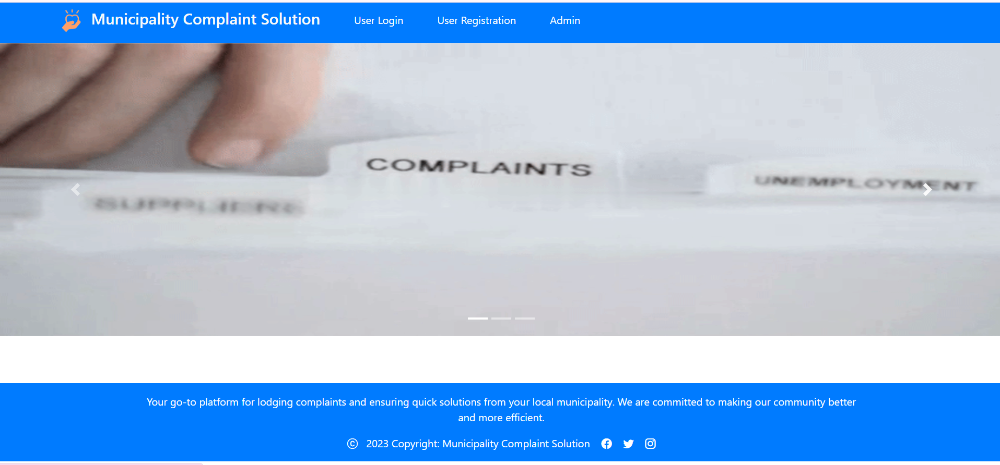

# Municipality Complaint Solution 🏙️  

A digital platform designed to handle municipal complaints efficiently. This system allows citizens to file complaints regarding municipal issues, tracks the status of complaints, and notifies both the citizens and authorities about the progress. The system ensures timely handling of complaints and promotes a cleaner, safer environment for all.

---
## Overview



## Features 🚀  

- **Complaint Management:** Allows citizens to file complaints related to municipal services.
- **Complaint Status Tracking:** Citizens can track the status of their complaints.
- **Admin Dashboard:** Enables authorities to manage, resolve, and close complaints.
- **Defaulter Identification:** Identifies areas or issues with repeated complaints for targeted action.
- **Responsive Design:** Fully functional on all devices and screen sizes.

---

## Tech Stack 🛠️  

| **Category**         | **Technologies**                 |  
|----------------------|----------------------------------|  
| **Frontend**          | HTML, CSS, JavaScript, Bootstrap |  
| **Backend**           | PHP, MySQL                      |  
| **Authentication**    | Session-based Authentication    |  

---

## Installation Guide 🖥️  

### Prerequisites  
Before starting, make sure you have the following installed:  
- [XAMPP](https://www.apachefriends.org/index.html) (for local server)  
- [MySQL](https://www.mysql.com/)  

### Steps  

1. **Clone the Repository**  
   Open your terminal or command prompt and run:  
   ```bash
   git clone https://github.com/rakeshsaunr/municipality-complaint-solution.git
   cd municipality-complaint-solution
